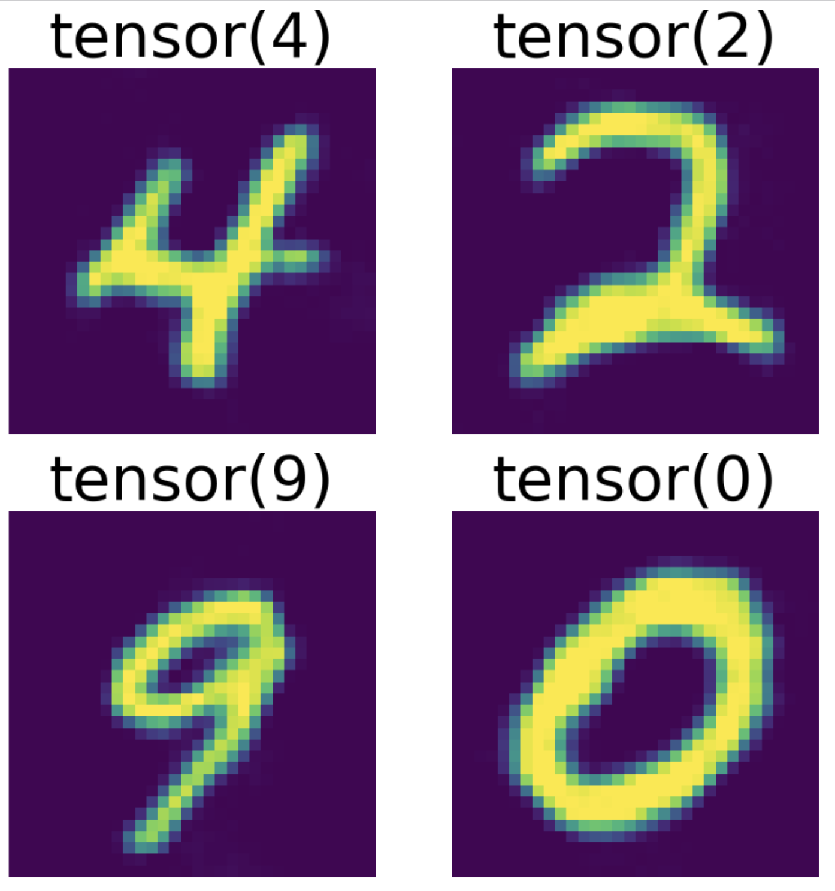

# rf-v3 — Rectified Flow v3



A class-conditional generative image model for MNIST digits, built on **rectified flow** (flow matching) with a transformer denoiser operating in a learned latent space. This is the third iteration of the rectified-flow generator in this repo (`rf-v1`, `rf-v2`, `rf-v3`).

The image above shows samples drawn from pure noise and conditioned on the digit labels `4`, `2`, `9`, `0` using classifier-free guidance.

## How it works

rf-v3 trains in two stages:

1. **Latent autoencoder.** An `Encoder`/`Decoder` pair is trained first (MSE reconstruction) to map 32×32 images into a compact latent of **16 tokens × 512 dim** (a 4×4 spatial grid) and back. Once trained, both are frozen.

2. **Rectified flow.** A transformer learns a velocity field over the frozen latent space. For each batch:
   - encode the image to `x1`, draw noise `x0 ~ N(0, I)`,
   - sample `t ~ U(0, 1)` and interpolate `x_t = (1 - t)·x0 + t·x1`,
   - predict velocity `v = model(x_t, prompt, t)` and minimize `MSE(v, x1 - x0)`.

   Sampling integrates this velocity field from noise back to data with an Euler ODE solver.

### Model

The denoiser is `BlenderV2` (`dim=512`, `num_layers=8`). Each layer runs joint self-attention over the **16 image tokens + 1 prompt token** (`F.scaled_dot_product_attention`), with pre-norm and a GELU MLP (`dim → 4·dim → dim`), wrapped in residual connections.

Conditioning signals:
- **Timestep** — sinusoidal embedding → linear → added to all tokens.
- **Class prompt** — `nn.Embedding(11, dim)`: digits `0–9` plus index `10` as the **null token** for classifier-free guidance.
- **Image position** — learned `nn.Embedding(16, dim)` added to the image tokens.

### Classifier-free guidance

During training the class prompt is dropped to the null token with probability `0.1`. At inference, conditional and unconditional velocities are combined:

```
v = v_uncond + guidance_scale · (v_cond - v_uncond)
```

with `guidance_scale = 5.0`.

## Training configuration

| Setting | Value |
| --- | --- |
| Dataset | MNIST (auto-downloaded to `./data`) |
| Image size | 32×32, normalized to [-1, 1] |
| Latent | 16 tokens × 512 dim |
| Model | `dim=512`, `num_layers=8` |
| Batch size | 512 |
| Autoencoder epochs | 25 |
| Rectified-flow epochs | 5000 |
| Optimizer | Adam, lr `1e-4` |
| CFG drop probability | 0.1 |
| Precision | bf16 autocast, `torch.compile` |
| Checkpoint | `checkpoints/rf-v3.pth` (saved every 5 epochs) |

## Usage

Dependencies are managed with [uv](https://docs.astral.sh/uv/) (Python ≥ 3.12).

### Train

```bash
uv run rf-v3.py
```

This runs both stages and writes weights to `checkpoints/rf-v3.pth`. To resume from a checkpoint, set `LOAD_MODEL = True` at the top of the script.

### Sample

Inference and sampling live in `rf-v3.ipynb`. Sampling uses Euler integration of the latent ODE:

- `num_steps = 50`, `dt = 1 / num_steps`, `guidance_scale = 5.0`,
- start from `x ~ N(0, I)` in latent space,
- at each step compute the CFG-guided velocity and update `x += v · dt`,
- decode once at the end, clamp to [-1, 1], and rescale to [0, 1].

The notebook includes cells for a single sample, a step-by-step animation, and an N×N grid (such as `demo.png`).

## Repository layout

```
sd-v4/
├── rf-v1.py / rf-v1.ipynb      # rectified flow v1
├── rf-v2.py / rf-v2.ipynb      # v2 (cross-attention blender)
├── rf-v3.py / rf-v3.ipynb      # v3 (current) — training + sampling
├── checkpoints/rf-v3.pth       # trained weights
├── data/MNIST/                 # downloaded dataset
├── demo.png                    # sample generations
└── pyproject.toml / uv.lock    # uv-managed dependencies
```

## Changes since v2

- **LayerNorm** added to the encoder output.
- **Late ReLUs removed** from the encoder (only the first conv block keeps its ReLU).
- **Learned image positional embeddings** (`nn.Embedding(16, dim)`).
- **Classifier-free guidance** added — prompt table grown `10 → 11` to hold the null token.
